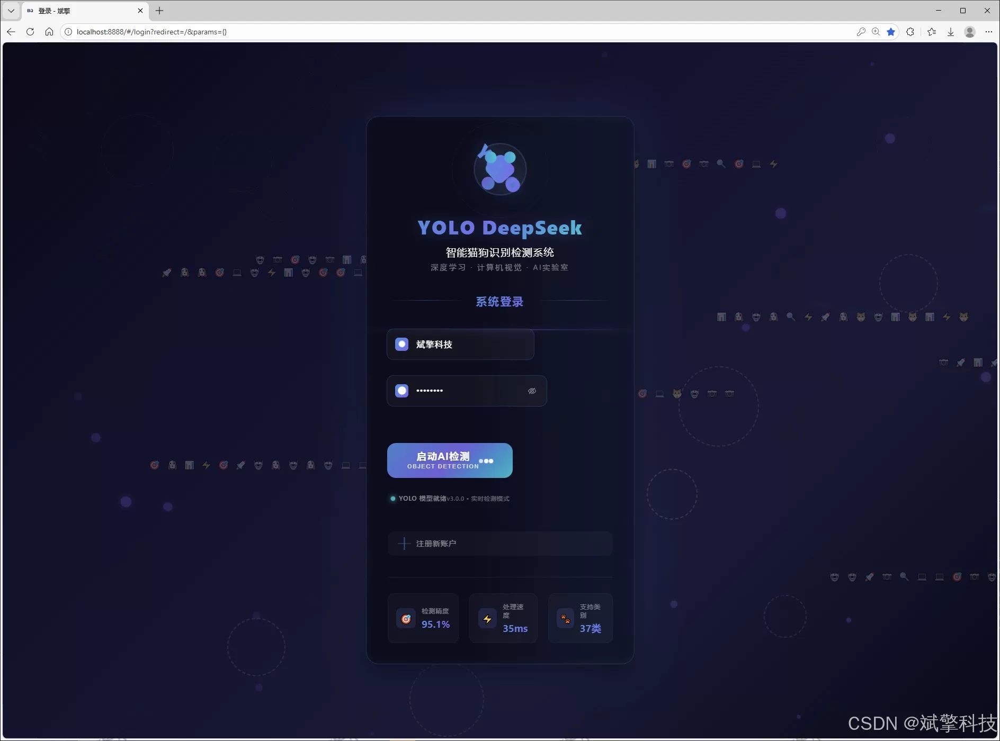
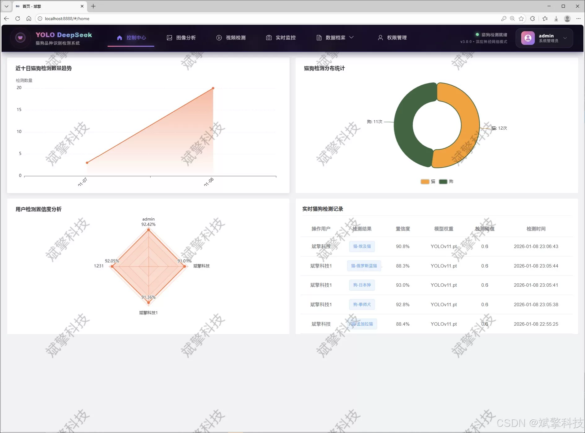
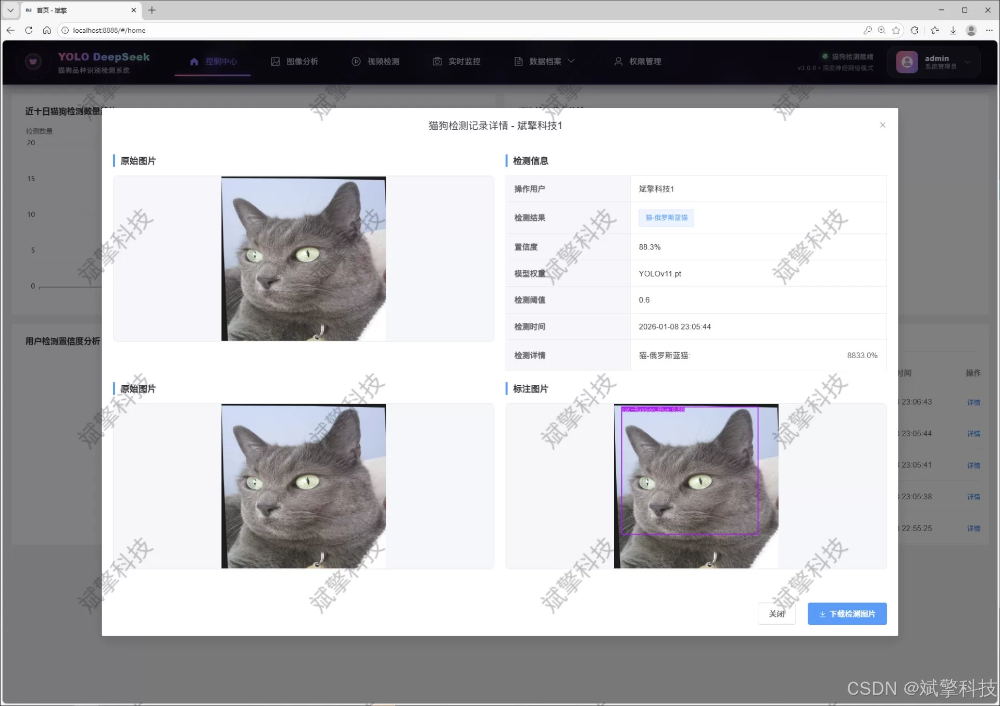
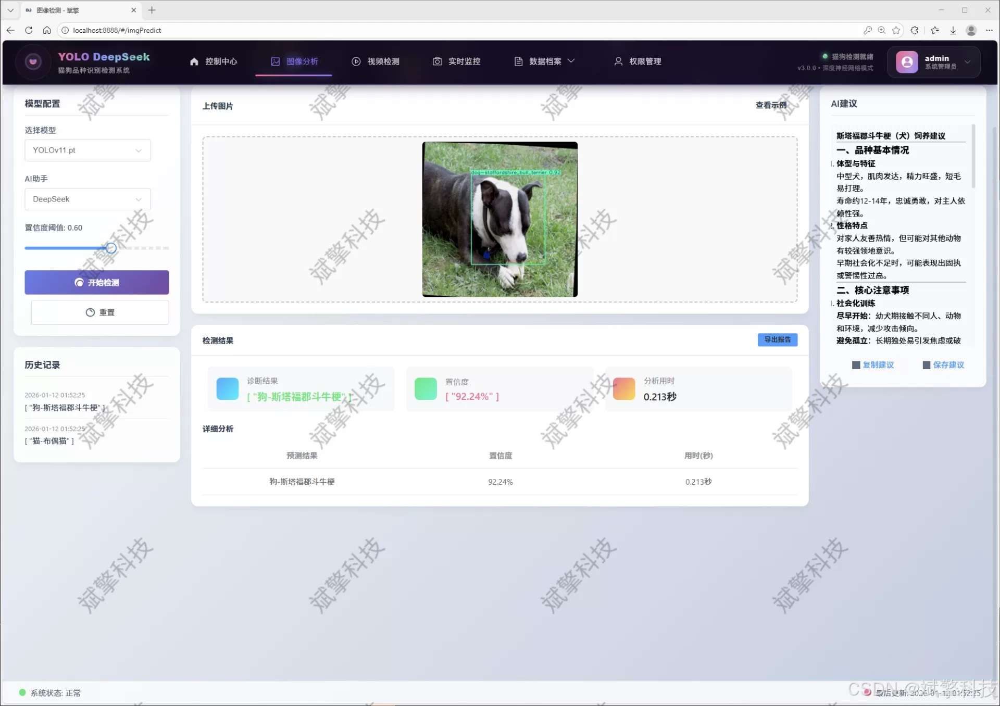
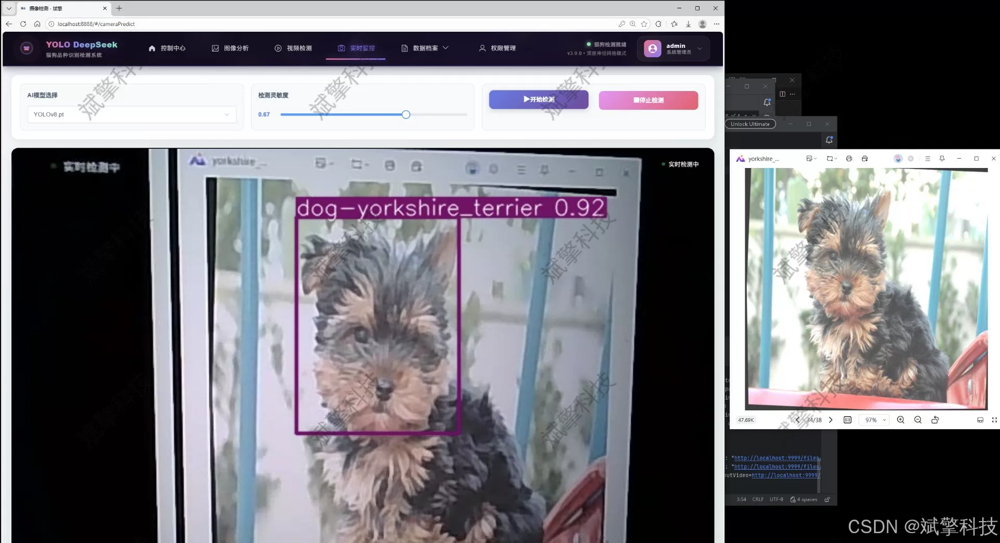
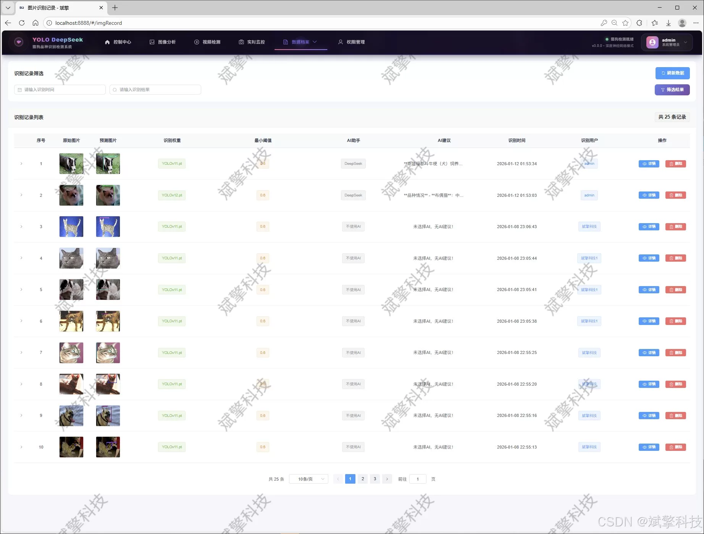
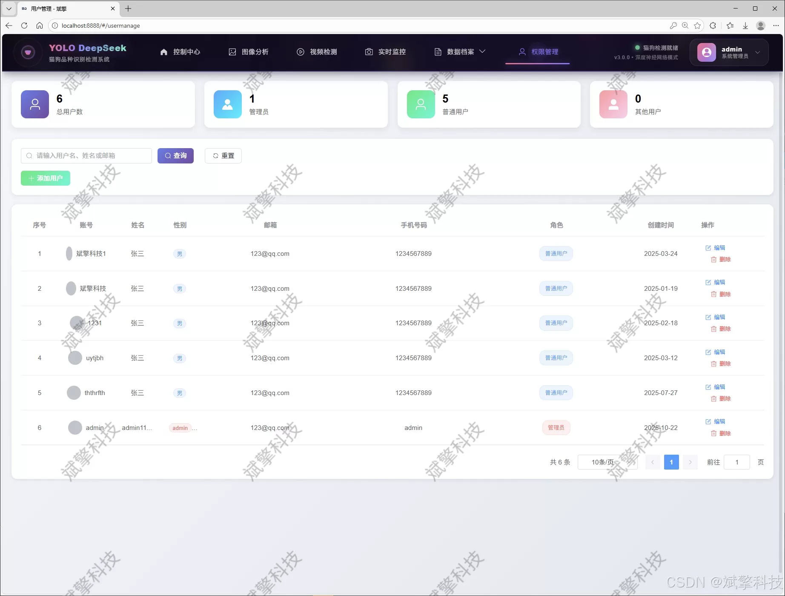
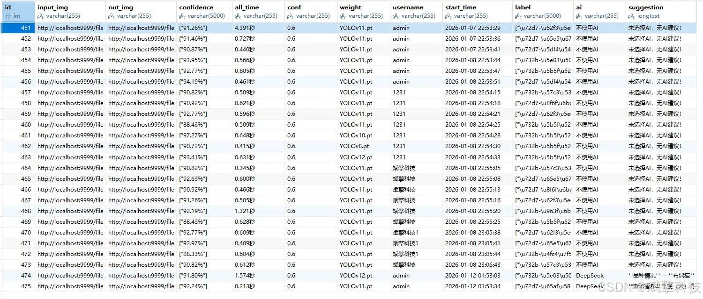

# YOLO+DeepSeek cat and dog breed detection

## Body

YOLO+DeepSeek is a cat and dog breed detection system based on YOLO deep learning and the large models of Qianwen and DeepSeek. The system includes DeepSeek intelligent analysis, web interaction interface, front-end and back-end separation, YOLO data, YOLOv8/YOLOv10/YOLOv11/YOLOv12.

The project aims to design and implement a comprehensive, efficient, and precise intelligent detection and analysis platform for fine-grained cat and dog breeds. The core of the system adopts the most cutting-edge YOLO series object detection models (including YOLOv8, YOLOv10, YOLOv11, and YOLOv12), which have built an accurate deep learning engine capable of recognizing 37 specific cat and dog breeds (covering 12 cat breeds and 25 dog breeds). The system's backend is constructed based on the SpringBoot framework, adhering to the modern architecture model of separating the frontend and backend. The frontend provides an intuitive Web interaction interface, ensuring the system's maintainability, scalability, and good user experience.

The system is not only a basic detection tool, but also an integrated platform that integrates data management, intelligent analysis, and user interaction. Its core functions include: support for real-time detection modes of image, video streams, and cameras; an intelligent analysis module integrated with the DeepSeek large language model to provide rich background interpretation of detection results; a complete data visualization dashboard to intuitively display detection statistics and model performance; and a robust user management system covering user registration and login, personal information management, and administrator back-end control. All detection records and user data are persistently stored in the MySQL database, achieving full-process data traceability and management.

By comparing the integration of multiple iterations of YOLO models, this project not only provides a practical pet recognition application, but also provides a basis for the performance comparison and selection of target detection models in fine-grained classification tasks. The system ultimately realizes a complete closed loop from algorithm to application, from data to insight, showing the great potential of combining deep learning technology with Web engineering development to solve practical problems.

Functional module

✅ User Login and Registration: Supports password detection, saves to MySQL database.

✅ Supports four YOLO model switches, YOLOv8, YOLOv10, YOLOv11, YOLOv12.

✅ Information Visualization, Data Visualization.

✅ Image detection supports AI analysis functions, deepseek and Qianwen.

✅ Supports image detection, video detection, and real-time camera detection. The results are saved to a MySQL database.

✅ Picture recognition record management, video recognition record management and camera recognition record management.

✅ User Management Module, administrators can add, delete, modify, and query users.

✅ Personal center, can modify their own information, password name profile picture and so on.

There is no Lunwen writing service, nor any Lunwen.

## Images

## Payment

Here is a pay link on Stripe ( https://buy.stripe.com/3cs8yP7sY87d0vu9AB ). Please contact me lonlonago@foxmail.com after funding $89, and I will send you a complete data files , thank you!

